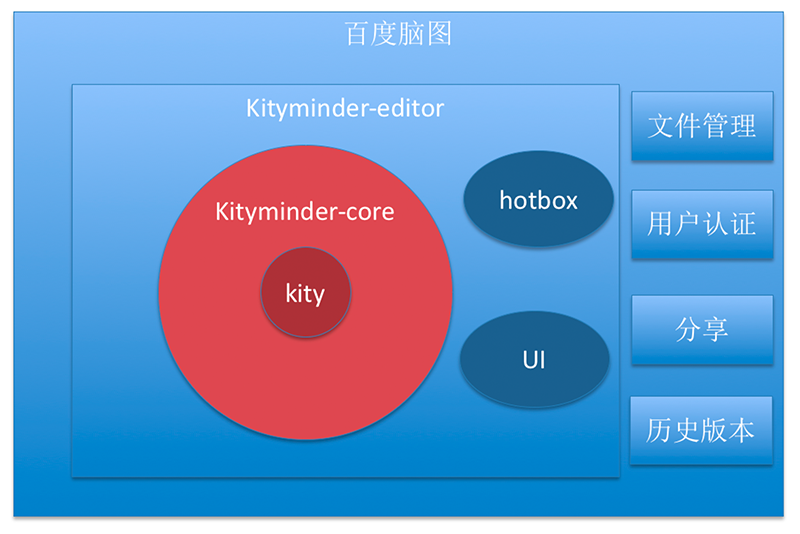

KityMinder Editor
==========

## 简介

KityMinder Editor 是一款强大、简洁、体验优秀的脑图编辑工具，适合用于编辑树/图/网等结构的数据。

编辑器由百度 [FEX](https://github.com/fex-team) 基于 [kityminder-core](https://github.com/fex-team/kityminder-core) 搭建，并且在[百度脑图](http://naotu.baidu.com)中使用。

他们的区别与联系如下：

- [kityminder-core](https://github.com/fex-team/kityminder-core) 是 kityminder 的核心部分，基于百度 [FEX](https://github.com/fex-team) 开发的矢量图形库 [kity](https://github.com/fex-team/kity)。包含了脑图数据的可视化展现，简单编辑功能等所有底层支持。
- [kityminder-editor](https://github.com/fex-team/kityminder-editor) 基于 kityminder-core 搭建，依赖于 AngularJS，包含 UI 和热盒 [hotbox](https://github.com/fex-team/hotbox) 等方便用户输入的功能，简单来说，就是一款编辑器。
- [百度脑图](http://naotu.baidu.com) 基于 kityminder-editor，加入了第三方格式导入导出 (FreeMind, XMind, MindManager) 、文件储存、用户认证、文件分享、历史版本等业务逻辑。

## 功能

- 基本操作：文本编辑，节点折叠、插入、删除、排序、归纳、复制、剪切、粘贴等
- 样式控制：字体、加粗、斜体、颜色、样式拷贝、样式粘贴等
- 图标：优先级、进度等
- 历史：撤销/重做
- 标签：多标签贴入
- 备注：支持 Markdown 格式备注
- 图片：支持本地/网络/搜索图片插入
- 超链接：支持 HTTP/HTTPS/MAIL/FTP 链接插入
- 布局：支持多种布局切换
- 主题：支持多种主题切换
- 数据导入导出：支持多种格式的导入，多种格式（包括图片）的导出
- 缩略图：支持缩略图查看/导航

## 使用
根目录下的 `index.html` 为开发环境，`dist` 目录下的 `index.html` 使用打包好的代码，适用于线上环境。

1. 安装 [nodejs](http://nodejs.org) 和 [npm](https://docs.npmjs.com/getting-started/installing-node)
2. 初始化：切到 kityminder-editor 根目录下运行 `npm run init`
3. 你可以基于根目录的 `index.html` 开发，或者查看 `dist` 目录下用于生产环境的 `index.html`，Enjoy it!

另外，kityminder-editor 还提供了 bower 包，方便开发者直接使用。你可以在需要用到 kityminder-editor 的工程目录下
运行 `bower install kityminder-editor`，接着手动引入 kityminder-editor 所依赖的 css 和 js 文件，具体文件见
`dist` 目录下的 `index.html`，推荐使用 npm 包 [wireDep](https://www.npmjs.com/package/wiredep) 自动进行，
可参考根目录下 `Gruntfile.js`。

## 构建
运行 `grunt build`，完成后 `dist` 目录里就是可用运行的 kityminder-editor

## 数据导入导出
由于 kityminder-editor 是基于 kityminder-core 搭建的，而 kityminder-core 内置了五种常见
格式的导入或导出，在创建编辑器实例之后，可以使用四个接口进行数据的导入导出。

* `editor.minder.exportJson()` - 导出脑图数据为 JSON 对象
* `editor.minder.importJson(json)` - 导入 JSON 对象为当前脑图数据
* `editor.minder.exportData(protocol, option)` - 导出脑图数据为指定的数据格式，返回一个 Promise，其值为导出的结果
* `editor.minder.importData(protocol, data, option)` - 导入指定格式的数据为脑图数据，返回一个 Promise，其值为转换之后的脑图 Json 数据

目前支持的数据格式包括：

* `json` - JSON 字符串，支持导入和导出
* `text` - 纯文本格式，支持导入和导出
* `markdown` - Markdown 格式，支持导入和导出
* `svg` - SVG 矢量格式，仅支持导出
* `png` - PNG 位图格式，仅支持导出

更多格式的支持，可以加载 [kityminder-protocol](https://github.com/fex-team/kityminder-protocol) 来扩展第三方格式支持。

数据格式的具体信息，可参考 [kityminder-core-wiki 的中的说明](https://github.com/fex-team/kityminder-core/wiki)。

## 联系我们
问题和建议反馈：

[Github issues](https://github.com/fex-team/kityminder-editor/issues)

邮件组：kity@baidu.com

QQ 讨论群：475962105